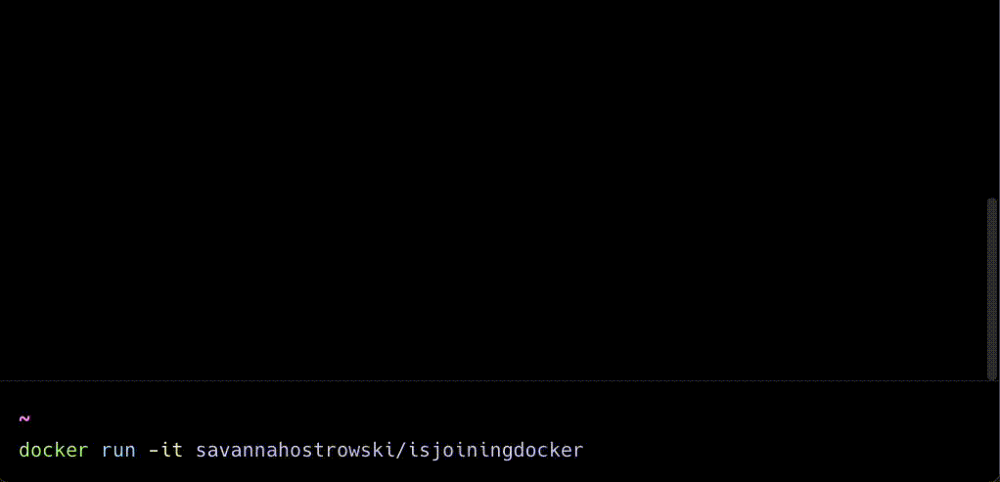

# Savannah's joining Docker! 🐳



Try it out:
```docker
docker run -it savannahostrowski/isjoiningdocker
```

[Image on DockerHub](https://hub.docker.com/repository/docker/savannahostrowski/isjoiningdocker/general)

This job announcement was made possible by:
- Docker (duh!)
- [Lipgloss](https://github.com/charmbracelet/lipgloss) by the fabulous folks over at [Charm](https://charm.sh/)
- [Warp terminal](https://www.warp.dev/)
